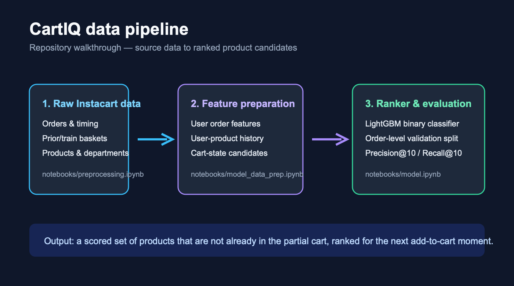
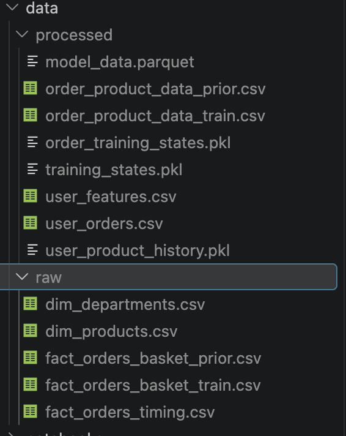
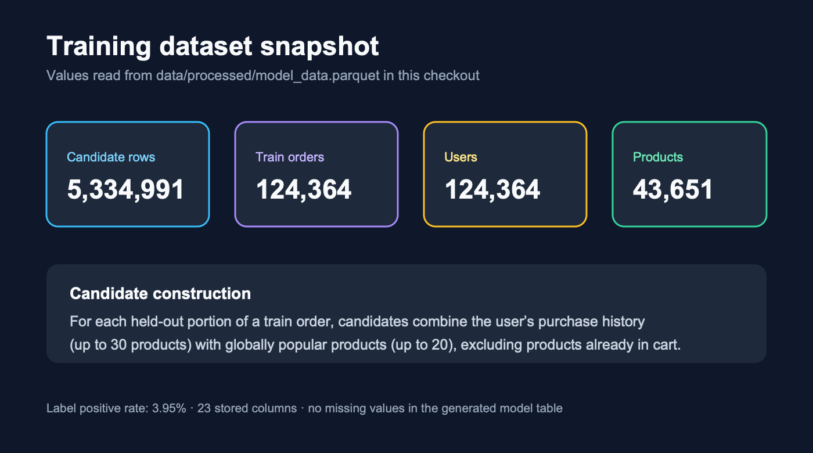
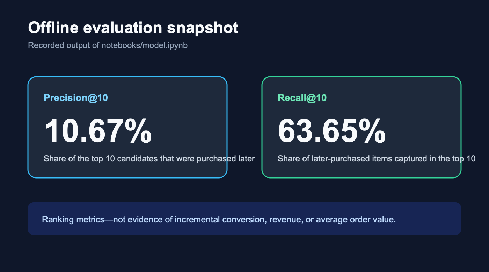

# CartIQ

CartIQ is an offline product-recommendation project for grocery and quick-commerce baskets. It learns which products a customer is likely to add next, using their purchase history, current cart size, and order context. The intended product surface is a focused add-to-cart suggestion—not a broad, generic recommendation carousel.

> Project status: this repository contains the data-preparation and offline-modeling workflow. It does **not** yet contain a deployed API, frontend, real-time feature store, or A/B-test results.



## Problem and scope

Small baskets often have limited margin. A relevant suggestion can increase basket value, but irrelevant suggestions add friction and may increase abandonment. CartIQ addresses the ranking problem: from a manageable set of eligible products, rank products that are most likely to be added later in the same order.

In scope:

- Build product-level prior and train-order tables from Instacart data.
- Derive user, user-product, cart-state, product, and order-context features.
- Generate candidates from a customer's product history and globally popular products.
- Train a LightGBM binary classifier and evaluate order-level top-10 rankings.

Out of scope:

- Proving incremental revenue, conversion lift, or reduced abandonment.
- Serving recommendations in production.
- Real-time inventory, price, margin, or promotion-aware ranking.

An online experiment is required before claiming business impact. Offline ranking metrics measure how well the model recovers products later added to the basket; they do not establish that showing a recommendation caused a purchase.

## Data is not in this repository

**The dataset is too large for GitHub and is deliberately Git-ignored.** The raw Instacart files are about 680 MB and the tables generated from them are about 3.6 GB, so a full local checkout of `data/` weighs roughly 4.3 GB. Nothing under `data/` is committed.

Because the files cannot be browsed on GitHub, the screenshot below shows exactly what the `data/` directory looks like after the pipeline has been run end to end. Use it as the reference for which files must exist and where.



`data/raw/` holds the five files you download yourself; `data/processed/` holds everything the notebooks generate. Sizes are from a completed local run:

| File | Location | Size | Origin |
| --- | --- | ---: | --- |
| `fact_orders_timing.csv` | `data/raw/` | 104 MB | Downloaded |
| `fact_orders_basket_prior.csv` | `data/raw/` | 551 MB | Downloaded |
| `fact_orders_basket_train.csv` | `data/raw/` | 24 MB | Downloaded |
| `dim_products.csv` | `data/raw/` | 2.1 MB | Downloaded |
| `dim_departments.csv` | `data/raw/` | 270 B | Downloaded |
| `order_product_data_prior.csv` | `data/processed/` | 2.5 GB | `preprocessing.ipynb` |
| `order_product_data_train.csv` | `data/processed/` | 110 MB | `preprocessing.ipynb` |
| `user_orders.csv` | `data/processed/` | 105 MB | `model_data_prep.ipynb` |
| `user_features.csv` | `data/processed/` | 9.1 MB | `model_data_prep.ipynb` |
| `user_product_history.pkl` | `data/processed/` | 711 MB | `model_data_prep.ipynb` |
| `training_states.pkl` | `data/processed/` | 112 MB | `model_data_prep.ipynb` |
| `order_training_states.pkl` | `data/processed/` | 12 MB | `model_data_prep.ipynb` |
| `model_data.parquet` | `data/processed/` | 58 MB | `model_data_prep.ipynb` |

`model_data.parquet` is the single table `notebooks/model.ipynb` trains on. At 58 MB it is by far the smallest useful artifact—if you want to share a run without shipping 4.3 GB, share that file.

## Data source

The data is the [Instacart Market Basket Analysis dataset](https://www.kaggle.com/datasets/psparks/instacart-market-basket-analysis). Download it separately, rename the files as below, and place them under `data/raw/`.

| Local file | Purpose |
| --- | --- |
| `fact_orders_timing.csv` | Order, customer, day, hour, and time-since-prior-order context |
| `fact_orders_basket_prior.csv` | Products in historical (`prior`) orders |
| `fact_orders_basket_train.csv` | Products in labeled `train` orders |
| `dim_products.csv` | Product name, aisle, and department key |
| `dim_departments.csv` | Department labels |

The raw dataset contains 3.42M order records, 32,434,489 prior basket rows across 3,214,874 prior orders, 1,384,617 train basket rows across 131,209 train orders, 206,209 customers, 49,688 products, and 21 departments.

## How it works

1. `notebooks/preprocessing.ipynb` splits the order-timing table into `prior` and `train`, joins each to its basket rows plus product and department dimensions, and writes `order_product_data_prior.csv` and `order_product_data_train.csv`.
2. `notebooks/model_data_prep.ipynb` builds customer features and customer-product history from the prior table, builds partial-cart states from the train table, generates candidate products with labels, joins every feature, and writes `model_data.parquet`.
3. `notebooks/model.ipynb` splits on unique `order_id` values, trains LightGBM, scores validation candidates, and reports Precision and Recall at 10 and 5.

Candidate construction, in detail: for each train order the basket is cut in half by `add_to_cart_order`. The first half is the partial cart; products in the second half are the positive targets. Candidates are the customer's historical products (up to 30) plus the 20 most globally popular products, minus anything already in the partial cart. Every candidate becomes one row, labeled 1 if it appears in the held-out half.

## Data and model snapshot



`model_data.parquet` has **5,334,991 candidate rows** across **124,364 train orders** and 124,364 customers, in 23 columns with no missing values after feature preparation. 210,902 rows are positive—a **3.95% positive rate**, which is the imbalance the evaluation numbers below have to be read against.

### Model features

19 of the 23 stored columns are fed to the model. `order_id`, `user_id`, `product_name`, and `target` are held out as identifiers or the label.

| Feature group | Included signals |
| --- | --- |
| Order context | `order_number`, `order_dow`, `order_hour_of_day`, `days_since_prior_order`, `cart_size` |
| Customer profile | `user_total_orders`, `user_avg_basket_size`, `user_avg_days_between_orders`, `user_avg_order_hour` |
| Customer-product history | `user_product_orders`, `user_product_reorders`, `user_product_first_order`, `user_product_last_order`, `user_product_reorder_rate`, `has_bought_before`, `has_reordered` |
| Product metadata | `product_id`, `aisle_id`, `department_id` |

## Offline evaluation



Split by unique `order_id` (80/20, `random_state=42`): 4,268,436 training rows with 169,043 positives, 1,066,555 validation rows with 41,859 positives. Model is `LGBMClassifier(objective="binary", n_estimators=300, learning_rate=0.05, num_leaves=31, random_state=42)`.

Recorded output of `notebooks/model.ipynb`:

| Metric | Result | Meaning |
| --- | ---: | --- |
| Precision@10 | 10.67% | About 1.07 of the ten highest-ranked candidates was purchased later in the order. |
| Recall@10 | 63.65% | The top ten captured about 63.65% of the products later added, out of the evaluated candidate set. |
| Precision@5 | 14.25% | About 0.71 of the top five was purchased later. |
| Recall@5 | 43.60% | The top five captured about 43.60% of the products later added. |

Precision rises and recall falls as the list shortens, which is the expected trade-off. These are offline ranking results from the notebook's order-level validation split. They are not a business-impact metric, and they must be recomputed after any change to the data, candidate generation, features, or model.

## Repository layout

```text
CartIQ/
├── data/                                     # Git-ignored, ~4.3 GB when populated
│   ├── raw/                                  # Downloaded Instacart inputs
│   └── processed/                            # Generated tables and model dataset
├── docs/screenshots/                         # README images
│   ├── data-pipeline.png                     # Three-stage pipeline diagram
│   ├── dataset-files.png                     # data/ directory after a full run
│   ├── dataset-snapshot.png                  # model_data.parquet statistics
│   └── model-evaluation.png                  # Precision@10 / Recall@10
├── notebooks/                                # The current end-to-end workflow
│   ├── preprocessing.ipynb                   # Raw tables → order-product tables
│   ├── model_data_prep.ipynb                 # Features, cart states, candidates → model_data.parquet
│   └── model.ipynb                           # LightGBM training and evaluation
├── src/                                      # Earlier exploratory work, not the current path
│   ├── ft_split.py                           # Feature/target split for an older candidate schema
│   ├── train_model.py                        # Older LightGBM run against that schema
│   └── preprocessing/
│       ├── base_layer.py                     # Association-rule (apriori) utility
│       └── model_data_preprcoessing.ipynb    # Association-rule exploration notebook
├── requirements.txt
└── README.md
```

The notebooks are the workflow that produced everything described above. The files under `src/` are earlier association-rule and feature-split experiments; they reference an older processed schema (`train_order_data.csv`, `master_orders.csv`) that the current pipeline no longer writes, so they will not run against today's `data/processed/`. They are kept as a record of the approach that preceded the candidate-ranking model.

## Run the workflow

### Prerequisites

- Python 3.13 (the pinned versions in `requirements.txt` were installed on 3.13; 3.10+ is likely fine if you relax the pins)
- Jupyter Notebook, JupyterLab, or the VS Code notebook editor
- About 4.3 GB of free disk for raw plus processed data
- At least 16 GB RAM: the prior order-product table alone occupies about 4.5 GB in memory during preparation

### Setup

```bash
git clone <your-repository-url>
cd CartIQ
python -m venv .cartiq
source .cartiq/bin/activate
pip install -r requirements.txt
```

`requirements.txt` includes `ipykernel`, so the virtualenv can be selected as a notebook kernel without extra installs. Add `jupyterlab` if you want to run the notebooks in a browser rather than in an editor.

Then download the Instacart files, rename them to the local filenames in the [data source table](#data-source), and put them in `data/raw/`.

### Fix the hard-coded paths first

The notebooks read and write through an absolute path to this author's checkout. Before running them in another clone, replace every occurrence of:

```text
/Users/abhijeetsinghparihar/Desktop/Projects/Supply Chain Project/CartIQ
```

with your own repository path.

### Execute in order

Run all cells, in this sequence:

1. `notebooks/preprocessing.ipynb`
2. `notebooks/model_data_prep.ipynb`
3. `notebooks/model.ipynb`

| Step | Key outputs |
| --- | --- |
| Preprocessing | `order_product_data_prior.csv`, `order_product_data_train.csv` |
| Feature and candidate preparation | `user_orders.csv`, `user_features.csv`, `user_product_history.pkl`, `training_states.pkl`, `order_training_states.pkl`, `model_data.parquet` |
| Modeling | LightGBM training output plus Precision and Recall at 10 and 5, printed in the notebook |

When the run finishes, `data/` should match [the directory screenshot above](#data-is-not-in-this-repository).

## Next steps

1. Move the notebook logic into parameterized, repo-relative scripts so a run does not depend on one machine's absolute path.
2. Save the trained model and add a small inference function that accepts cart and customer context.
3. Add catalog, availability, price, margin, and policy filters before recommendation display.
4. Run an A/B test with attach rate, conversion, average order value, margin, and abandonment as metrics.

## Tech stack

- Python, pandas, and PyArrow for data preparation and Parquet storage
- scikit-learn for the order-level validation split
- LightGBM for binary ranking scores
- mlxtend for the retained association-rule exploration utility

## License and attribution

This repository uses the Instacart Market Basket Analysis data for project and modeling purposes. Review and comply with the dataset's [Kaggle terms and license](https://www.kaggle.com/datasets/psparks/instacart-market-basket-analysis) before redistributing data or using it beyond that scope.
